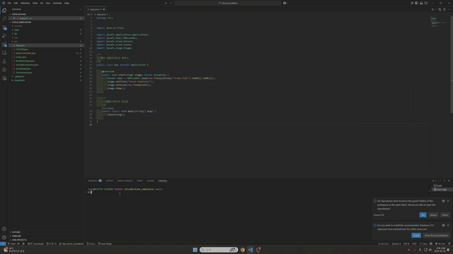

# 📈 Stock Trading Simulator

This application simulates U.S. stock trading based on historical data.

Users can place limit-on-close (LOC) orders and analyze portfolio performance interactively.



---

## 💻 Development Environment

| Item | Detail |
| --- | --- |
| OS | Windows 11 |
| IDE | VSCode (Visual Studio Code) |
| JDK | Java 21 or higher (tested on Java 24) |
| JavaFX SDK | 21.0.7 (included in `lib/` folder) |
| Python (optional) | 3.11+ (for CSV preprocessing) |
- Build & run tested with:`VSCode + Java Extension Pack + launch.json`

---

## 🚀 Running in VSCode

Make sure the following setup is configured:

- `launch.json` includes:
    
    ```json
    "vmArgs": "--module-path lib/javafx-sdk-21.0.7/lib --add-modules javafx.controls,javafx.fxml"
    
    ```
    
- `src/` contains Java source files.
- Working directory set to project root (`stock_simulation/`).

---

## 🛠 Running in Eclipse

If you're running this project in **Eclipse**, please follow these steps:

1. **Configure JavaFX SDK**
    - Go to: `Project` > `Properties` > `Java Build Path` > `Libraries`
    - Click `Add External JARs...` and add all the JAR files from `lib/javafx-sdk-21.0.7/lib`
    - Add the following **VM arguments**:
        
        ```
        cpp
        CopyEdit
        --module-path "lib/javafx-sdk-21.0.7/lib" --add-modules javafx.controls,javafx.fxml
        
        ```
        
2. **Set the Correct Source Folder**
    - Make sure the `src/` folder is marked as a **Source Folder**.
    - The `trade.fxml` file should be located either in the project root or directly under `src/` to be loaded properly.
3. **JDK Version**
    - Ensure that your Eclipse project is using **Java 21 or later** as its runtime environment.

---

## 📂 Folder Structure Overview

```
bash
CopyEdit
stock_simulation/
├── src/                  # Java source files
├── data/                 # CSV data + Python scripts
├── lib/                  # JavaFX SDK
├── .vscode/              # VSCode launch/settings
├── dist/                 # (optional) compiled executables
├── trade.fxml            # Main UI definition
├── README.md
└── .gitignore

```

---

## 🧪 Test Period

Default simulation runs from `2025-01-20` to `2025-05-15`.

Historical CSV files are included.

You can change the test range using `trunc.py`.

---

## 📜 License

This project is licensed under the MIT License – see the [LICENSE](LICENSE) file for details.
