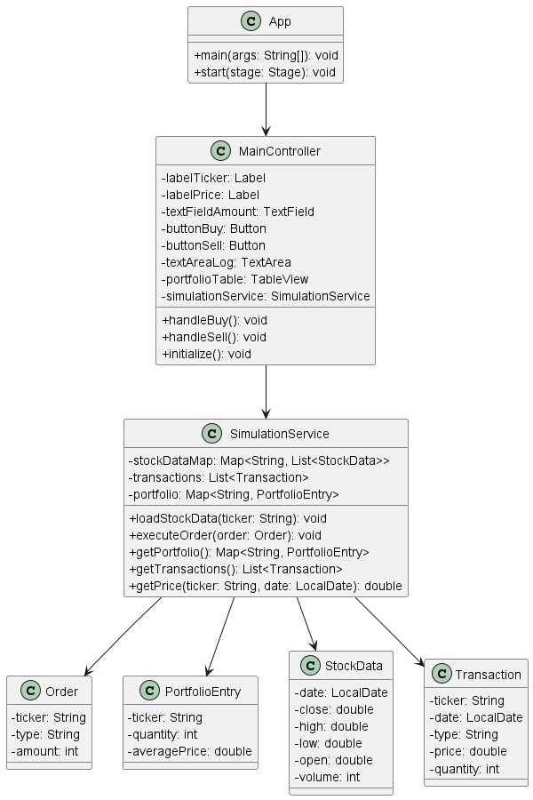

### 1. 📌 **애플리케이션의 목적 (Purpose of the Application)**

이 애플리케이션의 목적은 사용자가 실제 주가 데이터를 기반으로 주식 거래를 시뮬레이션하며, 금융적 리스크 없이 주식 투자 전략을 체험하고 학습할 수 있는 대화형 교육 도구를 제공하는 것입니다.

특히 이 시뮬레이터는 사용자가 **레버리지 ETF(TQQQ, SOXL, UPRO)**를 대상으로, 단순화된 LOC(Limit-On-Close) 방식의 거래를 수행하게 하여 다음과 같은 학습 효과를 제공합니다:

- 시장 상황에 따라 지정가 주문이 어떻게 체결되는지를 경험
- 자본 관리 및 포트폴리오 분산 전략을 학습
- 거래 결과를 다양한 차트와 통계를 통해 분석

이 도구는 초보 투자자, 금융 원리를 배우는 학생, 또는 주식 투자 전략을 실험해보고 싶은 사람들에게 적합합니다.

개인적으로는, 미국 주식을 하면서도 휴장일이나 변동성이 적은 날에는 시장이 멈춘 듯한 느낌을 받을 때가 많았습니다. 이러한 공백기를 채우기 위해, 과거의 데이터를 바탕으로 거래를 시뮬레이션하고 스스로의 판단을 복기해볼 수 있는 시스템을 만들고자 했습니다. 테스트 시점은 2025년 1월 20일부터 5월 15일까지로 설정했으며, 이는 트럼프가 47대 대통령으로 취임한 날을 시작점으로 선택한 것입니다. 경제적 사건(특히 관세)과 주가 흐름을 함께 살펴보며 투자에 대한 감각을 기를 수 있을 것이라 판단했습니다.

데이터는 동봉된 Python 스크립트(data/stock.py, data/truc.py)를 통해 원하는 기간으로 조정할 수 있어, 사용자의 필요에 따라 다양한 시점에서의 시뮬레이션이 가능합니다.

---

## 2. 📊 UML Diagram

---

## 3. 📘 Use Case: Stock Trading Simulator

### 🎯 목적

사용자가 LOC(Limit-On-Close) 방식으로 가상의 주식 거래를 시뮬레이션할 수 있도록 지원한다.

### 🧑‍💻 Actor

- **User (사용자)**: 트레이딩 시뮬레이션을 진행하는 사람

### 🗂 Use Cases

1. **Start Simulation**

- **설명**: 프로그램 실행 시 초기 자본 $5000으로 시뮬레이션 시작
- **Trigger**: 프로그램 실행
- **Main Flow**:
    1. 시작일 기준 첫 번째 거래일 데이터를 로딩
    2. 초기 예수금 $5000 표시
    3. 첫 종목(TQQQ)의 가격 추이 표시

2. **View Stock Price Trend**

- **설명**: 특정 종목의 과거 종가를 라인 차트로 확인
- **Trigger**: 종목 토글 버튼 클릭
- **Main Flow**:
    1. 사용자가 TQQQ, SOXL, UPRO 중 하나를 선택
    2. 해당 종목의 과거 종가를 좌측 `LineChart`에 표시

3. **Place Trade Orders**

- **설명**: 오늘 거래할 Buy/Sell 주문 추가
- **Trigger**: “거래 추가” 버튼 클릭
- **Main Flow**:
    1. 사용자가 거래 유형(Buy/Sell), 티커, 가격, 수량 입력
    2. 유효성 검사 (가격/수량 > 0)
    3. 거래 예정 리스트(`orderTableView`)에 추가
- **Alternate Flow**:
    - 음수 또는 0 입력 → 입력 오류 알림

4. **Delete Order**

- **설명**: 등록한 거래 예정 항목 삭제
- **Trigger**: 주문 항목의 ‘삭제’ 버튼 클릭
- **Main Flow**:
    1. 선택된 거래 항목 삭제
    2. UI에서 실시간 반영

5. **Execute Trades**

- **설명**: LOC 조건으로 거래 체결 시도
- **Trigger**: "Execute Trades" 버튼 클릭
- **Main Flow**:
    1. 거래 예정 리스트가 비었는지 확인
        - 비었을 경우: “건너뛰기” 확인창
    2. 주문 유효성 검증:
        - 매수 합계 ≤ 예수금
        - 매도 수량 ≤ 보유 수량
    3. LOC 조건 확인:
        - 매수: 종가 ≤ 주문가 → 체결
        - 매도: 종가 ≥ 주문가 → 체결
    4. 결과를 거래 내역에 기록
    5. 잔고·포트폴리오·차트 업데이트
    6. 다음 거래일로 이동
- **Alternate Flow**:
    - 예수금 부족: "매수 총액이 예수금을 초과합니다" 경고
    - 보유 수량 부족: "매도 수량이 보유 수량을 초과합니다" 경고

6. **View Portfolio**

- **설명**: 현재 보유 주식, 매입금액, 손익률 등 확인
- **Trigger**: 우측 “포트폴리오” 탭 선택
- **Main Flow**:
    1. 현재가, 평균 매수가, 수익률 계산
    2. PieChart 및 테이블로 시각화

7. **View History**

- **설명**: 체결된 거래 내역을 날짜순으로 열람
- **Trigger**: 우측 “거래 내역” 탭 선택
- **Main Flow**:
    1. 거래 내역 리스트 최신순으로 정렬
    2. ListView에 표시

8. **Help Information**

- **설명**: 거래 방식 및 조건 설명을 툴팁으로 제공
- **Trigger**: “?” 버튼 클릭
- **Main Flow**:
    1. 팝업창에 도움말 텍스트 표시
    2. “확인” 클릭 시 닫힘

---

## 4. 📊 **애플리케이션 실행 결과 (Result When the Application is Running)**

프로그램이 실행되면, 사용자는 다음과 같은 기능을 통해 **일 단위의 거래 시뮬레이션**을 수행할 수 있습니다:

1. **시장 시각화**
    
    사용자는 선택한 ETF(TQQQ, SOXL, UPRO)의 과거 **종가 가격 변동을 라인 차트**를 통해 확인할 수 있습니다.
    
2. **거래 주문 추가**
    
    매수/매도, 티커, 가격, 수량을 입력하여 **거래 예정 목록에 주문을 추가**할 수 있습니다.
    
3. **거래 실행**
    
    "Execute Trades" 버튼을 통해 **해당 일자의 거래를 LOC 방식으로 한 번에 처리**할 수 있습니다.
    
    - **매수:** 종가 ≤ 지정한 가격 → 체결
    - **매도:** 종가 ≥ 지정한 가격 → 체결
    - 체결되지 않은 주문도 내역에 기록됨 (체결 수량 0으로 표시)
4. **계좌 정보 관리**
    
    현재 예수금, 체결된 거래 내역, 보유 주식, 손익 정보를 **표 형식으로 제공**합니다.
    
    - 평균 매수가, 평가 금액, 수익률 등도 자동 계산되어 표시됩니다.
5. **포트폴리오 분석**
    
    다음과 같은 시각적 분석 도구를 제공합니다:
    
    - **예수금 vs 투자금 Pie Chart**
    - **종목별 보유 비중 Pie Chart**
    - **일별 손익률 변화 Line Chart**
6. **거래 내역 확인**
    
    모든 거래 기록은 최신순으로 **히스토리 탭에서 리스트 뷰 형식으로 열람**할 수 있습니다.
    
7. **도움말 팝업**
    
    거래 규칙, 시스템 가정(수수료 없음, LOC 방식 등), 예시 등의 정보를 담은 **도움말 창**이 제공되며, 상단 툴바의 "?" 버튼으로 접근 가능합니다.